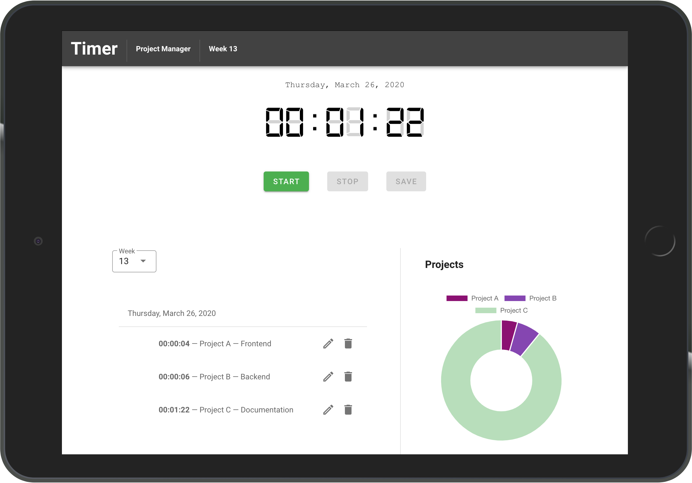

# Weekly Project Timer

## Description
This tool uses a built-in digital timer to calculate the time spent on a project in a specified time period. 
It uses the Browser's _LocalStorage_ to save every Entry, __nothing goes to a Backend!__
Your data remains your data! :metal:

You can add new time-entries to the list by starting the timer.

## Images
### Timer


### List


### Chart


### Application


## Setup
Note: To setup the project you have to install VueCLI.

### Project setup
```
npm install
```

#### Compiles and hot-reloads for development
```
npm run serve
```

#### Compiles and minifies for production
```
npm run build
```
