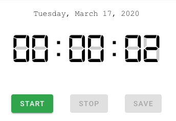

# Weekly Project Timer

## Description
This tool uses a built-in digital timer to calculate the time spent on a project in a specified time period. 

### Timer


### Project List


## Setup
### Project setup
```
npm install
```

#### Compiles and hot-reloads for development
```
npm run serve
```

#### Compiles and minifies for production
```
npm run build
```